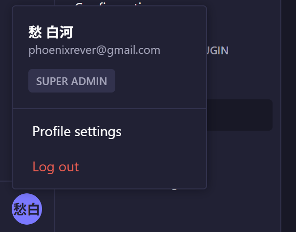
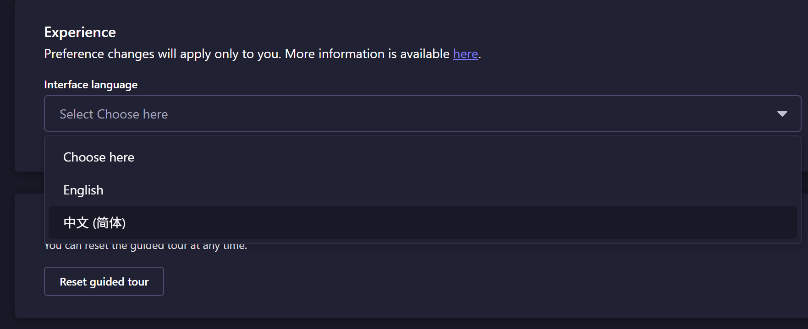
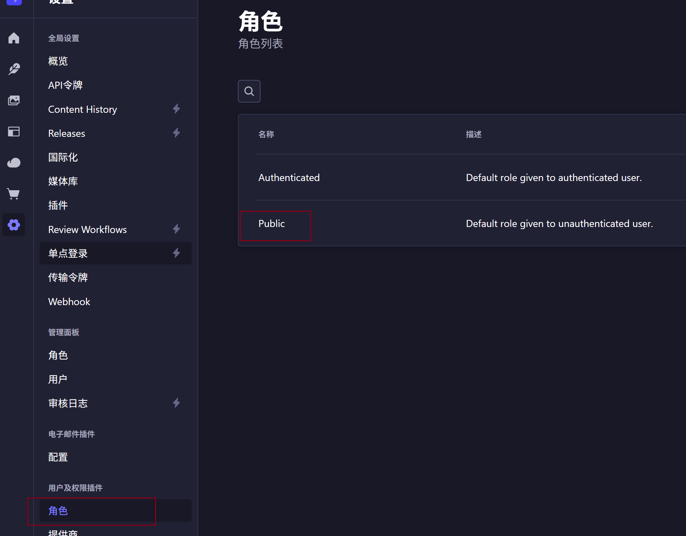
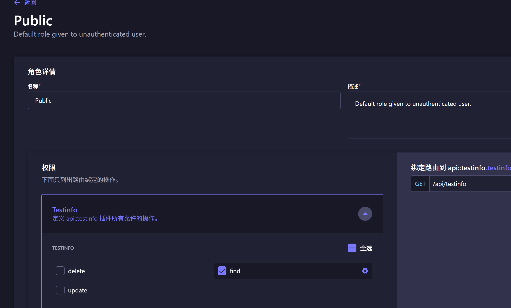
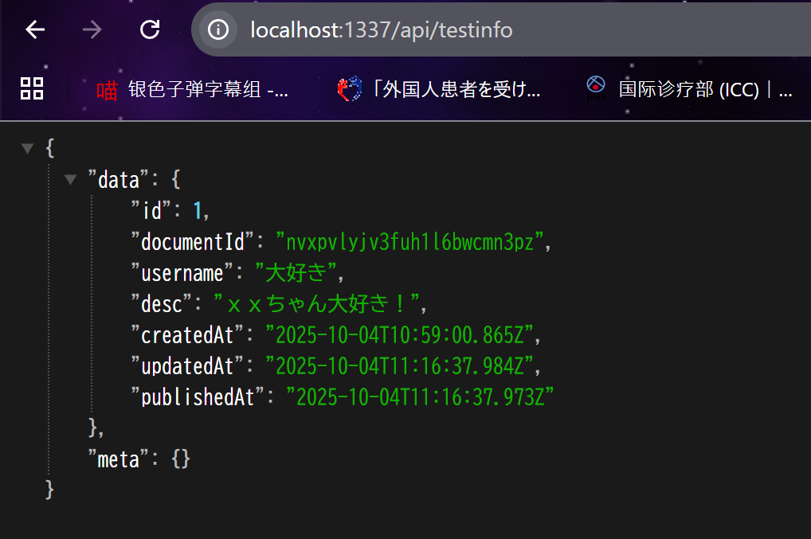
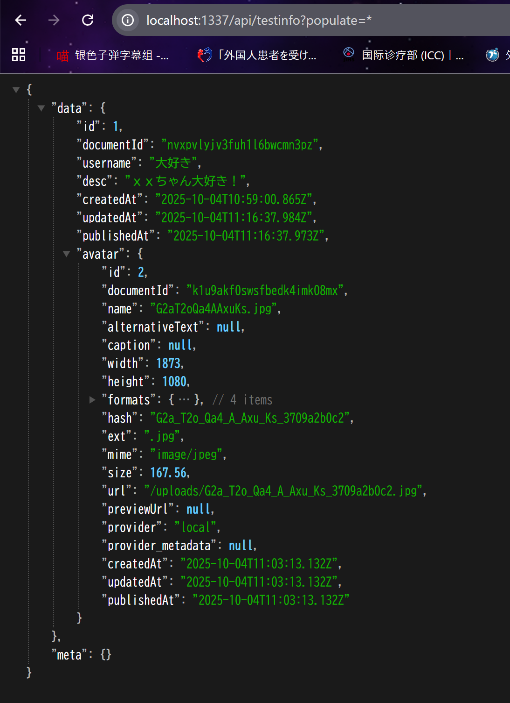
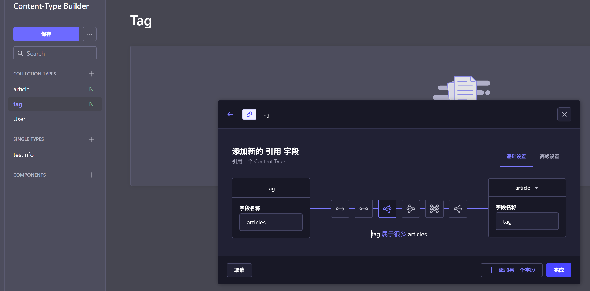
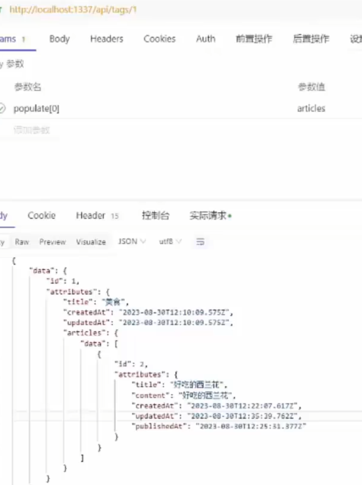

# 1.创建工程

```js
npx create-strapi@latest my-strapi-project
cd my-strapi-project && npm run develop
```

## 1.1 官网文档地址

https://docs.strapi.io/cms/quick-start

## 1.2 更改默认语言

```js
mv app.example.tsx app.tsx

打开 'zh-Hans',, 注释
```

然后在下图中就能看到语言配置





聊胜于无，基本没啥作用就是了。

# 2添加内容后要开发接口权限







```JSON
{
"data": {
"id": 1,
"documentId": "nvxpvlyjv3fuh1l6bwcmn3pz",
"username": "大好き",
"desc": "ｘｘちゃん大好き！",
"createdAt": "2025-10-04T10:59:00.865Z",
"updatedAt": "2025-10-04T11:16:37.984Z",
"publishedAt": "2025-10-04T11:16:37.973Z"
},
"meta": {}
}
```

可以看到少了媒体也就是avatar头像，这是因为strapi出于性能考虑，默认不会查，可以用 populate=\*

具体见文档 https://docs.strapi.io/cms/api/rest/populate-select#population



# 3. 关于Strapi的UI界面的位置

啊，这个点你问得特别好 👍，很多刚接触 **Strapi** 的人都会找“UI 界面源码在哪”。

答案是： **Strapi 的管理后台 UI 并不是放在你项目里生成的文件夹，而是内置在 Strapi 包里的** 。

---

## 🗂️ Strapi 项目结构里为什么看不到 UI 代码

当你 `npx create-strapi-app my-project` 之后，目录大概是这样的：

```
my-project/
  ├── api/              # 你的内容模型 & 控制器
  ├── config/           # 配置文件
  ├── extensions/       # 插件或覆盖的扩展
  ├── public/           # 静态文件
  ├── src/              # 业务逻辑代码 (v4 开始主要放这里)
  └── package.json
```

你能看到的，主要是 **后端部分（Koa + Node.js）** 。

但是你在浏览器里打开的 `/admin` 界面（那个 UI 管理后台），并不在这些文件夹里。

---

## 🎨 Strapi 管理后台 UI 的来源

1. **管理后台 UI 是 React 写的**

   - 官方源码在 GitHub：

     👉 [https://github.com/strapi/strapi/tree/main/packages/core/admin](https://github.com/strapi/strapi/tree/main/packages/core/admin)

   - 技术栈：React + Redux + Webpack + styled-components。

2. **为什么你项目里看不到？**
   - 当你启动 Strapi (`npm run develop`) 时，Strapi 会自动 **编译并打包 Admin 前端** ，然后作为静态资源放进 `.cache` 或 `build` 目录。
   - 也就是说，你看到的 UI 是编译好的 React 应用，不是源码。
3. **如何自定义 UI？**

   - Strapi 提供了 **Admin Customization API** ，可以在你的项目里创建：

     ```
     src/admin/
     ```

     然后写插件或覆盖组件，来自定义后台页面。

   - 官方文档：👉 [https://docs.strapi.io/developer-docs/latest/development/admin-customization.html](https://docs.strapi.io/developer-docs/latest/development/admin-customization.html)

---

## 📝 总结

- 你在本地项目里看不到 UI 源码，因为它是打包好的 React 应用，内置在 Strapi 包里。
- UI 源码在 **Strapi 官方仓库的 `packages/core/admin`** 。
- 如果要定制，需要在你的项目里加 `src/admin/`，按 Strapi 的扩展机制来覆盖。

---

要不要我帮你写一个「例子」：比如在 `src/admin` 下加一个按钮，修改后台 UI？这样你能直观理解 Strapi 的 UI 是怎么定制的。

# 4. 文字字段的一对多与多对一



具体上官网查看

这些查tag的时候就会带着它的article子数据 populate[tag][populate][0]=article 等参数能得到子JSON数据


